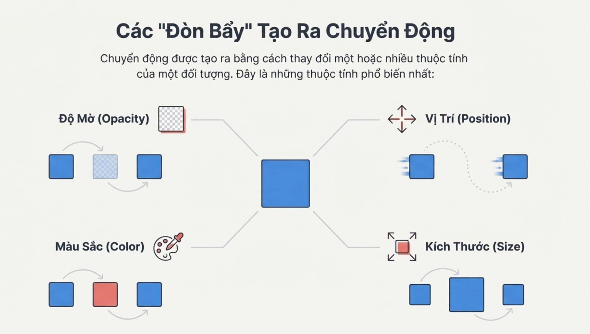

# 🎯 TỔNG QUAN: CÁC “ĐÒN BẨY” TẠO CHUYỂN ĐỘNG

| Đòn bẩy | Thuộc tính CSS |
|--------|----------------|
| Độ mờ | `opacity` |
| Vị trí | `transform: translate()` |
| Kích thước | `transform: scale()` |
| Màu sắc | `background-color` |
| (Nâng cao) | Kết hợp nhiều đòn bẩy |

---

## 1️⃣ ĐỘ MỜ – OPACITY (Fade In / Fade Out)

### 📘 Giải thích
- `opacity` nhận giá trị từ **0 → 1**
- Thường dùng cho: **load trang, popup, banner**

### 🧪 DEMO 1: Fade In khi load trang

#### STEP 1 – HTML
```html
<div class="box fade"></div>
````

#### STEP 2 – CSS cơ bản

```css
.box {
  width: 120px;
  height: 120px;
  background: #4a90e2;
}
```

#### STEP 3 – Animation

```css
.fade {
  animation: fadeIn 1.2s ease-in forwards;
}

@keyframes fadeIn {
  from { opacity: 0; }
  to   { opacity: 1; }
}
```

### ✅ Ghi chú

* Giải thích `forwards`
* Thử đổi `1.2s → 3s`

### 🧩 BÀI TẬP

* Tạo **3 khối xuất hiện lần lượt** bằng `animation-delay`

---

## 2️⃣ VỊ TRÍ – POSITION (Translate)

### 📘 Giải thích

* Không dùng `left / top`
* Dùng `transform: translate()` → **mượt & tối ưu hiệu năng**

### 🧪 DEMO 2: Slide từ trái sang phải

#### HTML

```html
<div class="box move"></div>
```

#### CSS

```css
.move {
  animation: slideIn 1s ease-out forwards;
}

@keyframes slideIn {
  from {
    transform: translateX(-200px);
    opacity: 0;
  }
  to {
    transform: translateX(0);
    opacity: 1;
  }
}
```

### 🎓 Ghi chú

* Thêm `opacity` → chuyển động **“có hồn”** hơn

### 🧩 BÀI TẬP

* Slide từ **dưới lên** + `delay 0.5s`

---

## 3️⃣ KÍCH THƯỚC – SIZE (Scale)

### 📘 Giải thích

* `scale(1)` = kích thước gốc
* Hay dùng cho **hover, button, card**

### 🧪 DEMO 3: Phóng to khi xuất hiện

```css
.scale {
  animation: zoomIn 0.8s ease-out forwards;
}

@keyframes zoomIn {
  from {
    transform: scale(0.5);
    opacity: 0;
  }
  to {
    transform: scale(1);
    opacity: 1;
  }
}
```

### 📌 Ghi chú

* `scale(1.2)` → cảm giác **“nảy”**
* Kết hợp `ease-out`

### 🧩 BÀI TẬP

* Hover vào thẻ → phóng to **110%**

---

## 4️⃣ MÀU SẮC – COLOR

### 📘 Giải thích

* `background-color` có thể `transition`
* Dùng cho **hover, trạng thái active**

### 🧪 DEMO 4: Đổi màu mượt

```css
.color {
  background: #3498db;
  transition: background-color 0.5s ease;
}

.color:hover {
  background: #e74c3c;
}
```

### 🎓 Ghi chú

* Thêm `border-radius`
* So sánh **có / không transition**

### 🧩 BÀI TẬP

* Hover đổi màu + bo góc + scale nhẹ

---

## 5️⃣ KẾT HỢP – “ĐÒN BẨY KÉP” (RẤT QUAN TRỌNG)

> ⛔ Dạy animation mà **không dạy kết hợp** là thiếu.

### 🧪 DEMO 5: Slide + Fade + Scale

```css
.combo {
  animation: comboIn 1s ease-out forwards;
}

@keyframes comboIn {
  from {
    transform: translateY(40px) scale(0.8);
    opacity: 0;
  }
  to {
    transform: translateY(0) scale(1);
    opacity: 1;
  }
}
```

### 🧩 BÀI TẬP LỚN (CUỐI BUỔI) 🔥

Tạo **card sản phẩm**:

* Load: slide + fade
* Hover: scale + đổi màu
* Có delay từng card

---

# 🔁 CÁCH LÀM ANIMATION LẶP LẠI

## 1️⃣ Lặp vô hạn (phổ biến nhất)

```css
.fade {
  animation: fadeIn 2s ease-in infinite;
}
```

## 2️⃣ Lặp có số lần

```css
.move {
  animation: slideIn 1s ease-out 3;
}
```

## 3️⃣ Lặp qua lại – `animation-direction`

```css
.scale {
  animation: zoomIn 0.8s ease-in-out infinite alternate;
}
```

## 4️⃣ Lặp có nghỉ nhịp – `animation-delay`

```css
.combo {
  animation: comboIn 1.2s ease-out infinite alternate;
  animation-delay: 1s;
}
```

> ⚠ `delay` chỉ áp dụng **lần đầu**
> Muốn nghỉ giữa các vòng → dùng `keyframes` (nâng cao)

## 5️⃣ Cú pháp chuẩn

```css
animation: name duration timing iteration direction;
```

## 6️⃣ So sánh

| Cấu hình               | Cảm giác  |
| ---------------------- | --------- |
| `infinite`             | Máy móc   |
| `infinite + alternate` | Tự nhiên  |
| `ease-in`              | Chậm đầu  |
| `ease-out`             | Chậm cuối |
| `ease-in-out`          | Mượt nhất |

## 7️⃣ BÀI TẬP CHO SINH VIÊN

* Khối nhấp nháy mờ – rõ liên tục
* Khối trượt trái – phải qua lại
* Khối phóng to – thu nhỏ (loading)

## 8️⃣ GỢI Ý NÂNG CAO (BUỔI SAU)

* `animation-play-state: paused`
* Dừng animation khi hover
* Kết hợp JS bật / tắt animation

